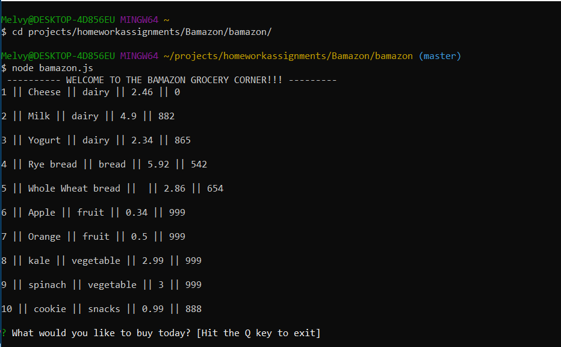
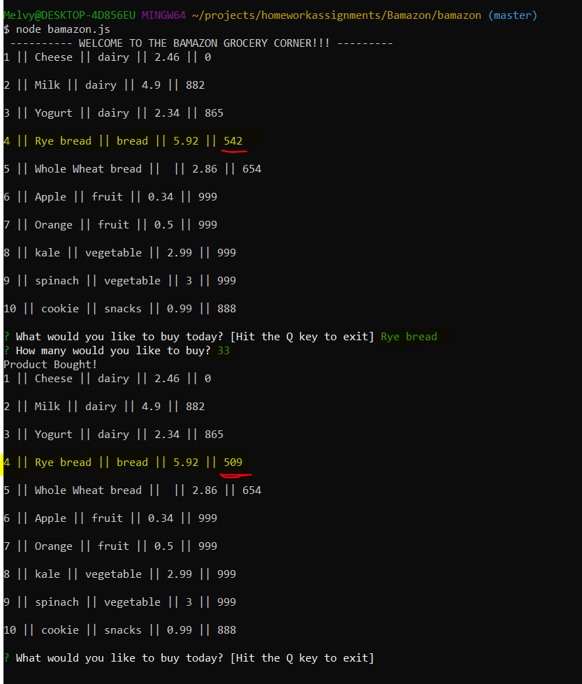
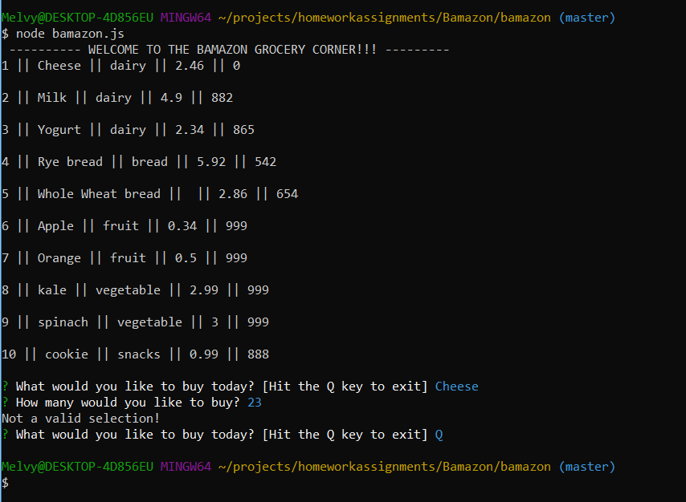

# bamazon

A command line nodejs/mysql app

Bamazon is a command line app that utilizes node.js, and mySQL to present the user with a menu of items. They are then propmpted to key in an item they would like to purchase from the menu. They are then prompted to enter in an amount they would like to purchase. The app then removes the amount that is purchased from the stores total inventory and the user is prompted to buy again.  

The following is a demonstration of the functionalitonality of this app

This Image shows the node app running, along with the welcome sign and menu, including the items, prices, and quantities for sale

This image shows the app running. The prompt asks the user which item they would like to buy, followed by the quantity. After this, the user is prompted to key in an amount they would like to purchase. Once this is complete, the stock quantity of that item that was purchased will be updated, reflecting the transaction that just occurred

This image shows an item being selected that is not in stock. The user is then returned with a prompt letting them know that this was not a valid selection. After this, the capital “Q” key is hit so that the User can quit out of the application